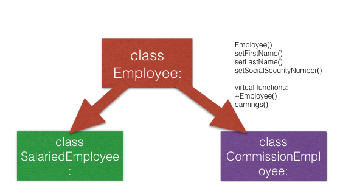

## Why?
We want to combine the strengths of scripting langugage, especially Python with the strengths of a compiled language. A high-level scripting language is more efficient for prototyping than a compiled language with its'  compile-debug development.

We can have legacy code that we want to make use of, but the nature of the code base inhibits further development. Hence we want to move forward in high-level scripting language, but make use of previous code or work.

Our scripting language code base has performance problems. The time consumed to solve certain task is to high. Consequently we want to move certain functions to a compiled language.

All these motivation point to a situation where we want to extend the ability of our high-level scripting interpreter, our case Python.

We start out with examples with different technologies. We are getting our hands dirty with SWIG, Boost and Pybind11. 

{:class="img-repsonsive"}

```python
>>> import scipy
>>> import taylor
>>> scipy.sin(3.141592653/3)
0.86602540368613978
>>> taylor.sin(3.141592653/3,15)
0.8660254036861398
>>> 
```
Here we import the well known scipy, https://www.scipy.org package, and call the function sin(). We also import the unknown tss_ext library and call a function ts_sin() which returns the approximately same result as scipy.sin().

The tss_ext library is a shared library built from C++ source files, made available to the python interpreter with the Boost Library. Here the python scripting environment has been extended with functions from a C++ code base.


## How does a scripting language to talk to C/C++?

Here we have a simple virtual class Employee:
```C++
class Employee {
 public:
  Employee(const std::string&, const std::string&, const std::string&);
  virtual ~Employee() = default;  // compiler generates virtual destructor

  void setFirstName(const std::string&);  // set first name
  std::string getFirstName() const;      // return first name

  void setLastName(const std::string&);   // set last name
  std::string getLastName() const;       // return last name

  void setSocialSecurityNumber(const std::string&); // set SSN
  std::string getSocialSecurityNumber() const;     // get SSN

  // purt virtual function makes Employee an abstract base class
  virtual double earnings() const = 0;  // pure virtual
  virtual std::string toString() const; // virtual
 private:
  std::string firstName;
  std::string lastName;
  std::string socialSecurityNumber;
};

```
{:class="img-repsonsive"}

The figure shows two classes SalariedEmployee and CommisionEmploye which inherit Employee. These two classes must implement the virtual functions according to the C++-standard.

From Python we would like to make use of these classes and their methods in a way like this:

```Python
>>> t = CommisionEmployee('Molly','Malone', "333-33-3333",19000,.05,)
>>> u = SalariedEmployee('John','Jones', '111-11-1111', 15000)
>>> t.earnings()
20150
>>> u.earnings()
15000
```
How do we accomplish this, making the Employee class hierarchy available in the python interpreter? Python, as most scripting language, has a foreign function interface which defines how external functions commands can hook into the interpreter, here the C/C++ reference manual https://docs.python.org/2/c-api/.

You will need to write a special wrapper that serves as a glue between the C/C++function and the Python interpreter. The Python interpreter also needs to known how to call the wrapper (the name,arguments. We could do this by following the reference manual, but here we will show how this can be done with different tools.


Inspired by the SWIG-3.0 documentation, http://www.swig.org/Doc3.0/
Reference to book